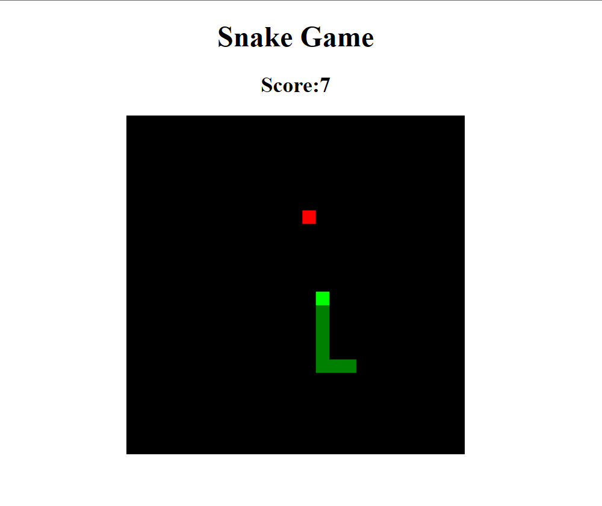

# Snake Game 🐍 in Vanilla JavaScript
* "Space" => Pause/Resume 
* "Arrow keys" => Move the snake towards food 

## Screenshots

## Features to add

- Detect Body Collision
- Generate food only in the grid positions where snake/snake body is not present

